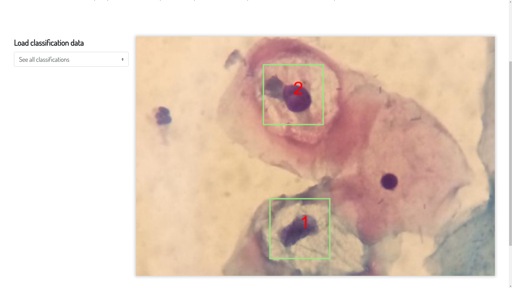

Cell Classification
===================

Smears containing atypias in squamous cells can be classified such as
Low–grade squamous intraepithelial lesion (LSIL),
High–grade squamous intraepithelial lesions (HSIL),
Invasive cervical cancer (Ca invasor).
Smears containing atypia in glandular cells can be classified such as
adenocarcinoma in situ (AIS)
or
invasive adenocarcinoma (cervical, endometrial or other non-specific).

The description of atypias in squamous cells follow.

Atypical squamous cells of undetermined significance (ASC-US)
-------------------------------------------------------------

This atypia occurs in mature cells of the squamous epithelium of the cervix. ASC-US refers to cytological abnormalities that are qualitatively or quantitatively insufficient for a interpretation Low-grade intraepithelial lesion (LSIL). The interpretation of ASC requires that the cells in question demonstrate three essential features: (1) squamous differentiation, (2) increased nuclear to cytoplasmic ratio, and (3) minimal nuclear changes which may include hyperchromasia, chromatin clumping, irregularity, smudging, and/or multinucleation. Nuclei are approximately two and one half to three times the area of the nucleus of a normal intermediate squamous cell (approximately 35 mm 2) or twice the size of a squamous metaplastic cell nucleus (approximately 50 μm 2). In other words, there is a slightly increased ratio of the nuclear area to the cytoplasmic área. The clinical course adopted in this case is the repetition of the Pap smear at 3 years for women aged up to 25 years, at 1 year for those aged 25-29 years and at 6 months for women over 30 years.

Low–grade squamous intraepithelial lesion (LSIL)
------------------------------------------------

Abnormalities in mature cells of the squamous epithelium of the cervix. The criteria used to define this cytological abnormality are: nuclear enlargement more than three times the area of normal intermediate nuclei results in a low but slightly increased nuclear to cytoplasmic ratio; nuclei are generally hyperchromatic but may be normochromatic; nuclei show variable size (anisonucleosis); chromatin is uniformly distributed and ranges from coarsely granular to smudgy or densely opaque; contour of nuclear membranes is variable ranging from smooth to very irregular with notches; binucleation and multinucleation are common; nucleoli are generally absent or inconspicuous if present. Non-invasive squamous abnormality is associated with human papillomavirus (HPV), which is observed microscopically by means of koilocytosis or perinuclear cavitation consisting of a clear and widely delineated perinuclear zone and a densely-colored peripheral border of cytoplasm is a characteristic. The clinical course adopted in this case is the repetition of the Pap smear in 3 years for women up to 25 years and in 6 months for women from 25 years.

Atypical squamous cells cannot exclude an HSIL (ASC-H)
------------------------------------------------------

Atypia affects young cells of the squamous epithelium of the uterine cervix. ASC-H refers to cytological abnormalities that are qualitatively or quantitatively insufficient for a interpretation High–grade squamous intraepithelial lesions (HSIL). ASC-H is a designation reserved for the minority of ASC cases (expected to represent less than 10 % of all ASC interpretations) in which the cytologic changes are suggestive of HSIL. The interpretation of ASC requires that the cells in question demonstrate three essential features: (1) squamous differentiation, (2) increased nuclear to cytoplasmic ratio, and (3) minimal nuclear changes which may include hyperchromasia, chromatin clumping, irregularity, smudging, and/or multinucleation. The clinical management adopted in this case is the referral for colposcopy and if there is any abnormality in the colon, the biopsy is performed. If no change is observed in the cervix, a new cytology is done in 6 months.

High–grade squamous intraepithelial lesions (HSIL)
--------------------------------------------------

Abnormalities in young cells of the squamous epithelium of the cervix. While overall cell size is variable, in general, the cells of HSIL are smaller than those of LSIL. Higher-grade lesions often contain quite small basal-type cells. Nuclear to cytoplasmic ratio is higher in HSIL compared to LSIL. Nuclei are generally hyperchromatic but may be normochromatic or even hypochromatic. Chromatin may be fi ne or coarsely granular and is evenly distributed. Contour of the nuclear membrane is quite irregular and frequently demonstrates prominent indentations or grooves. The clinical management adopted in this case is the referral for colposcopy and if there is any abnormality in the colon, the biopsy is performed. If no change is observed in the cervix, a new cytology is done in 3 months.

Invasive cervical cancer (Ca invasor)
-------------------------------------

Squamous cell carcinoma is an invasive epithelial tumor composed of squamous cells of varying degrees of differentiation. Some cytomorphological features that can be observed are: predominantly isolated cells, marked variation in cellular size and shape, with caudate and spindle cells, nuclei vary markedly in area, nuclear membranes may be irregular, and numerous dense opaque nuclei are often presente, chromatin pattern is coarsely granular and distributed irregularly, macronucleoli may be seen, presence of tumor diathesis. The clinical management adopted in this case is the referral for colposcopy and if there is any abnormality in the colon, the biopsy is performed.