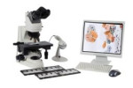

Photo Documentation
===================

The photo documentation for CRIC Database were done
following conventional microscopy
in light field
with objective len of 40&times;
and ocular len of 10&times;.
The digita camera was Zeiss AxionCam MRc
attached to microscopy Zeiss AxioImager.Z2
powered by Software Axion Vision Zeiss.

Images only represent a small portion of the microscope slide
as ilustrated below.

Acknowledge
-----------

- Laboratório Multiusuário do Núcleo de Pesquisas em Ciências Biológicas (NUPEB),
Universidade Federal de Ouro Preto and their staff
  - Mariana Trevisan Rezende
